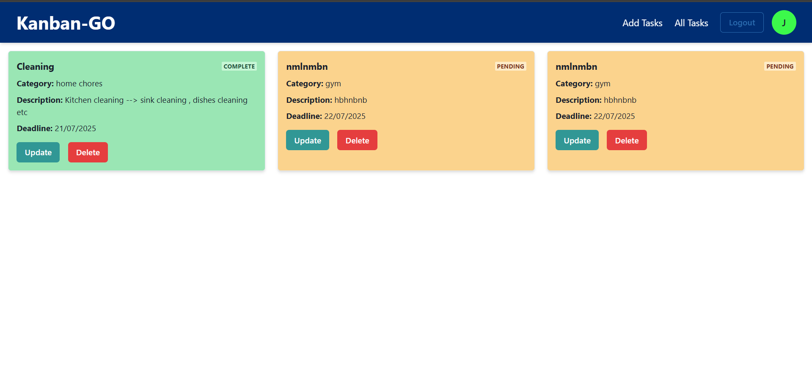
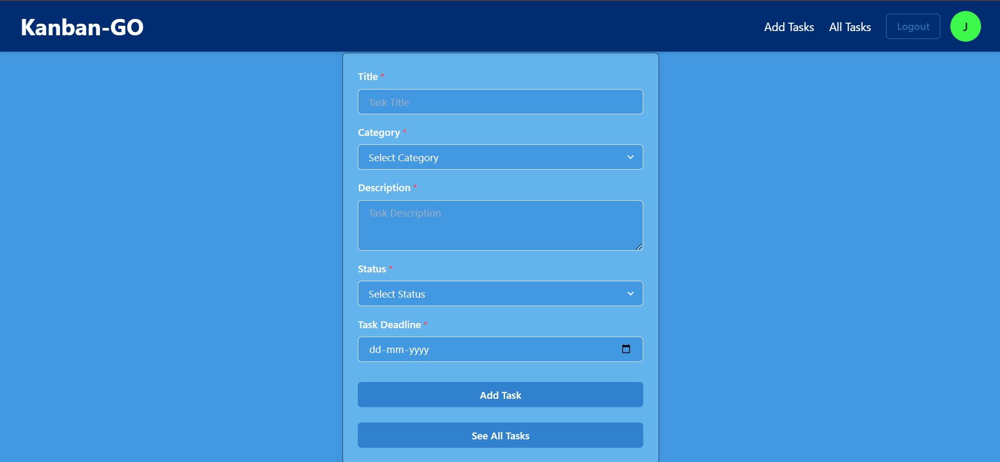
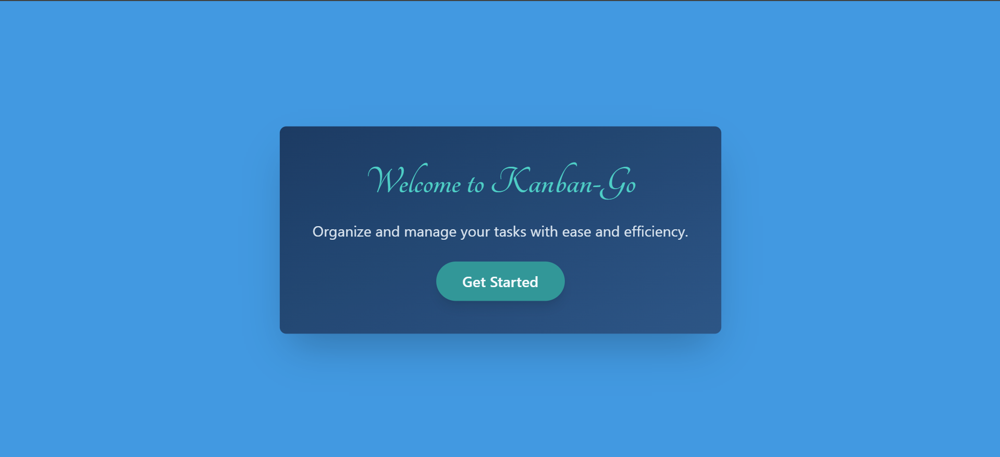
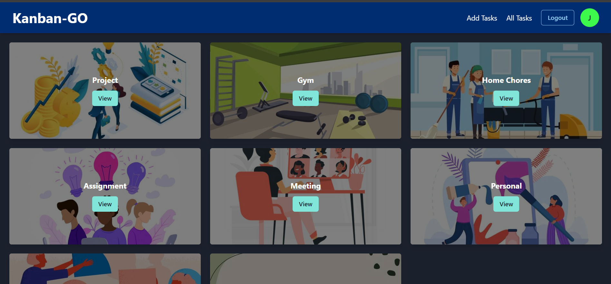
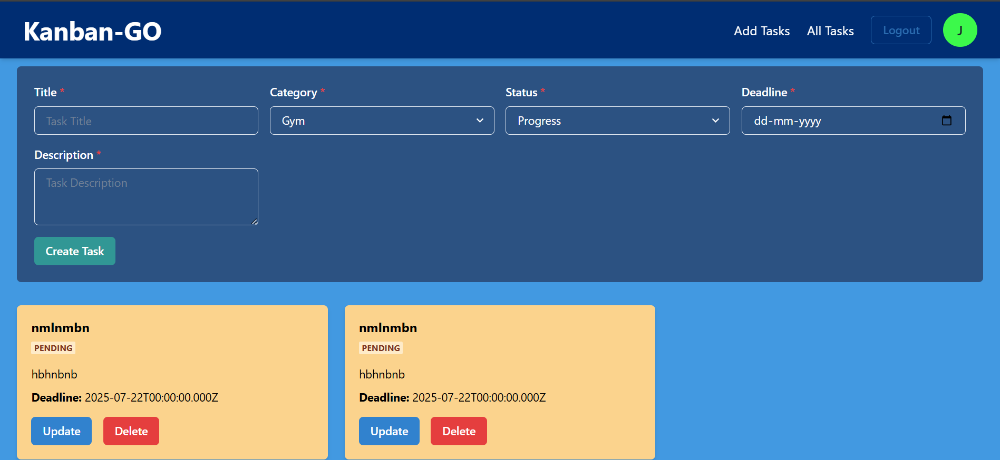

# Kanban-Go 🧩
A full-stack Kanban Board web application for managing and organizing tasks based on their status — built with **React**, **Node.js**, **Express**, **JWT**, and **MongoDB (Mongoose)**.

🚀 [Live Demo](https://kanban-board-1-5b37.onrender.com/)

---

## 📸 Project Screenshots

> _You can add images by uploading them to the repo or using external links like Imgur, Cloudinary, or GitHub CDN._

| Home Page | Task List | Add Task |
|-----------|-----------|----------|
|  |  |  |

---

## 🛠 Tech Stack

### Frontend:
- React.js
- Chakra UI
- React Router DOM
- JWT Authentication
- Fetch API

### Backend:
- Node.js
- Express.js
- MongoDB
- Mongoose
- JSON Web Tokens (JWT)
- CORS, dotenv, bcrypt

---

## ✨ Features

- 🔐 **Authentication**
  - User login/signup with JWT
  
- 📋 **Task Management**
  - Add, update, delete tasks
  - Each task has:
    - Title
    - Description
    - Category
    - Status: `Pending`, `In Progress`, `Completed`
    - Deadline
  - Color-coded badges based on task status

- 🧭 **Navigation & UI**
  - Responsive navigation bar
  - Conditional rendering based on login status
  - Chakra UI theme for styling and responsiveness

- 🔍 **Filtering & Organization**
  - View tasks by status/category
  - Simple and clean Kanban structure

---

# [Project Live Link](https://kanbango.vercel.app)

## Contact
Created by [Tanishka](https://github.com/tanishkasharmaaa/Kanban-Board) - feel free to reach out on [linkedIn](https://www.linkedin.com/in/tanishka-sharma-304953274/)!

## Product Images

